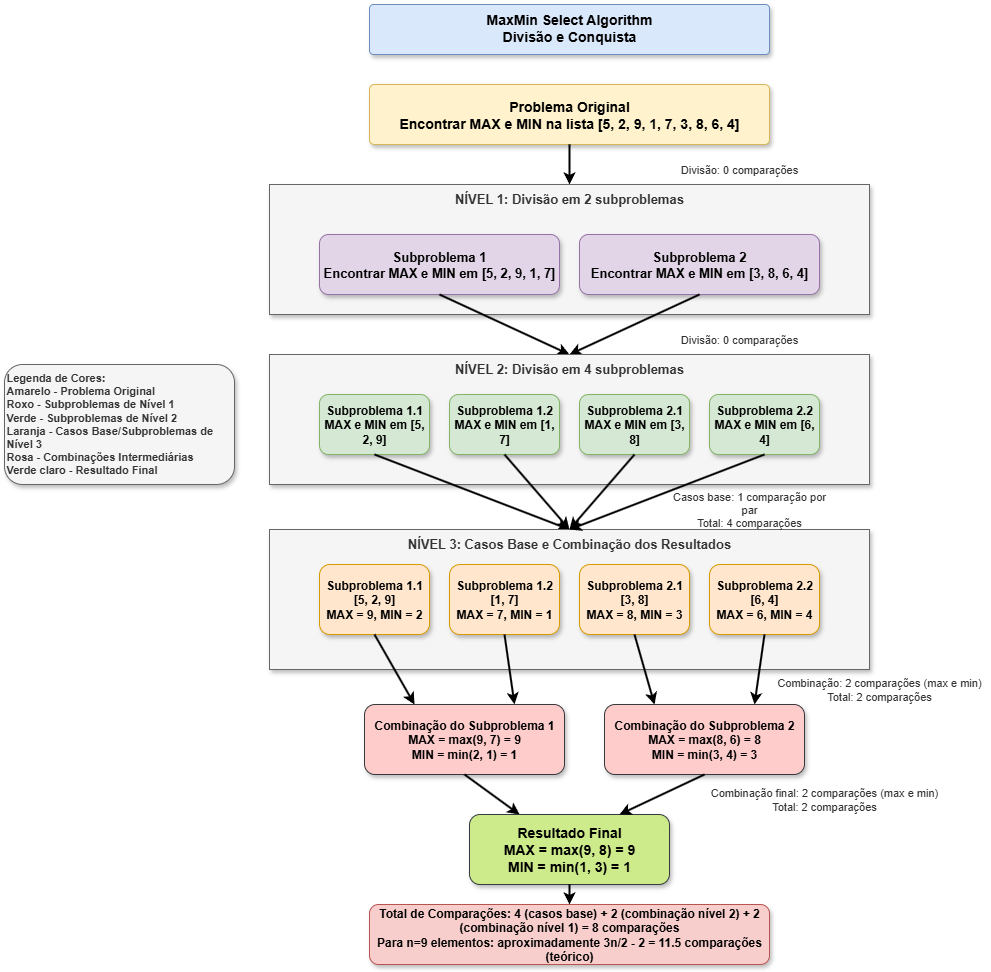

# Algoritmo de Seleção Simultânea do Maior e do Menor Elementos (MaxMin Select)

## Descrição do Projeto

Este projeto implementa o algoritmo de seleção simultânea do maior e do menor elementos de uma sequência de números (MaxMin Select) utilizando a abordagem de divisão e conquista em Python. O algoritmo reduz o número de comparações necessárias em comparação com uma abordagem ingênua, sendo uma aplicação clássica do paradigma de divisão e conquista.

### Detalhamento da Implementação

O algoritmo é implementado no arquivo `main.py` e segue a seguinte lógica:



1. **Função principal `max_min(arr, start, end)`**:
   - Recebe um array `arr` e os índices `start` e `end` que delimitam a porção do array a ser analisada.
   - Retorna uma tupla contendo o maior e o menor elementos encontrados nessa porção.

2. **Casos base**:
   - Se há apenas um elemento (start == end), retorna esse elemento como maior e menor.
   - Se há dois elementos (end - start == 1), compara-os e retorna o maior e o menor.

3. **Divisão do problema**:
   - Calcula o ponto médio `mid = (start + end) // 2` para dividir o array em duas metades.
   - Chama recursivamente a função para cada metade: `max_min(arr, start, mid)` e `max_min(arr, mid + 1, end)`.

4. **Combinação dos resultados**:
   - Após obter o maior e o menor elementos de cada metade, realiza a combinação final.
   - O maior elemento global é o máximo entre os maiores de cada metade.
   - O menor elemento global é o mínimo entre os menores de cada metade.

5. **Função auxiliar `find_max_min(arr)`**:
   - Simplifica a chamada da função principal inicializando start=0 e end=len(arr)-1.
   - Verifica se o array não está vazio antes de prosseguir.

## Como Executar o Projeto

Para executar este projeto em seu ambiente local, siga estas etapas:

1. Certifique-se de que o Python 3.x está instalado em sua máquina.
2. Clone ou baixe este repositório para o seu computador.
3. Navegue até o diretório do projeto no terminal.
4. Execute o seguinte comando:

```bash
python main.py
```

ou se tiver o python 3:

```bash
python3 main.py
```

O programa executará o algoritmo MaxMin Select em três listas diferentes:
- Uma lista pequena com 9 elementos
- Uma lista média com 100 elementos gerados aleatoriamente
- Uma lista grande com 10.000 elementos gerados aleatoriamente

## Relatório Técnico

### Análise da Complexidade por Contagem de Operações

O algoritmo MaxMin Select utiliza a abordagem de divisão e conquista para encontrar o maior e o menor elementos com menos comparações do que uma busca linear simples.

O diagrama abaixo ilustra o processo de divisão e conquista para encontrar o maior e o menor elementos de uma lista:


Vamos analisar o número de comparações realizadas:

- Para n = 1 (um único elemento): 0 comparações (o elemento é tanto o maior quanto o menor).
- Para n = 2 (dois elementos): 1 comparação (comparamos os dois elementos).

Para n > 2, o algoritmo:
1. Divide o problema em dois subproblemas de tamanho n/2.
2. Resolve cada subproblema recursivamente.
3. Combina os resultados com 2 comparações (uma para o máximo e uma para o mínimo).

Podemos expressar isso como uma recorrência:
- T(1) = 0
- T(2) = 1
- T(n) = T(n/2) + T(n/2) + 2 = 2T(n/2) + 2

Desdobrando essa recorrência:
T(n) = 2T(n/2) + 2
     = 2(2T(n/4) + 2) + 2
     = 4T(n/4) + 4 + 2
     = 4T(n/4) + 6
     = 8T(n/8) + 12
     ...

Continuando esse processo até alcançar o caso base (n = 1 ou n = 2), temos aproximadamente log₂n níveis de recursão. O último nível (caso base) tem n/2 problemas de tamanho 2 ou 1, contribuindo com n/2 comparações. Os níveis anteriores contribuem com um total de aproximadamente 2n - 2 comparações para a combinação.

Portanto, o total de comparações é aproximadamente:
- Número de comparações ≈ 3n/2 - 2

Isso resulta em uma complexidade temporal de O(n), que é linear com relação ao tamanho da entrada.

### Análise pelo Teorema Mestre

A recorrência do algoritmo MaxMin Select é:
T(n) = 2T(n/2) + O(1)

Aplicando o Teorema Mestre, T(n) = aT(n/b) + f(n), onde:
1. a = 2 (número de subproblemas)
2. b = 2 (fator de redução do tamanho do problema)
3. f(n) = O(1) (custo da combinação dos resultados)

Calculando log_b(a):
log₂(2) = 1

Como f(n) = O(1) = O(n^0) e 0 < 1 = log₂(2), estamos no caso 1 do Teorema Mestre.

Caso 1: Se f(n) = O(n^c) onde c < log_b(a), então T(n) = Θ(n^log_b(a))

Portanto, T(n) = Θ(n^1) = Θ(n)

Isto confirma que o algoritmo MaxMin Select tem uma complexidade temporal de Θ(n), que é ótima para o problema de encontrar simultaneamente o maior e o menor elementos de uma sequência.

### Conclusão

O algoritmo MaxMin Select usando divisão e conquista consegue reduzir o número de comparações necessárias para encontrar o maior e o menor elementos de uma sequência. Enquanto uma abordagem ingênua (verificar cada elemento separadamente para máximo e mínimo) requer 2n-2 comparações, este algoritmo requer aproximadamente 3n/2-2 comparações.

Tanto pela análise direta das operações quanto pela aplicação do Teorema Mestre, confirmamos que a complexidade temporal do algoritmo é O(n), que é linear e ótima para este problema.

---

Projeto desenvolvido como parte da disciplina de Fundamentos de Projeto e Análise de Algoritmos.

Pedro Carbonaro - 871659